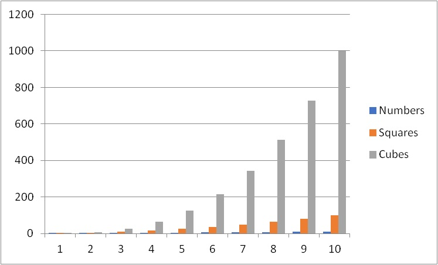
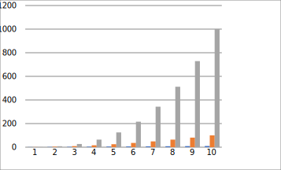

# SVG library for VBA

These are preleminary release of SVG library for VBA.
The aim of the library is to export charts in SVG format, i. e. in lossless image format.

| JPG | SVG |
|--------------------:|------------------------------------|
|  |  |

An example of the table is available [here](https://github.com/Excel-lent/SVG-library-for-VBA/releases/download/v0.0.1-alpha/SVGlib.Example.xlsm).