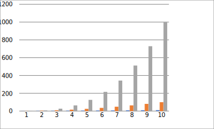

# SVG library for VBA

This is a preleminary release of SVG library for VBA. Not everything is working properly. Not all properties are implemented.
The aim of the library is to export charts in SVG format, i. e. in lossless image format.

An example of the table is available [here](https://github.com/Excel-lent/SVG-library-for-VBA/releases/download/v0.0.1-alpha/SVGlib.Example.xlsm).

The benefits are:
* Smaller size of the picture, all benefits of vector graphics (sharp, scallable images):
| 
JPG (39 kB)
 | 
SVG (7 kB)
 |
|--------------------|------------------------------------|
|  |  |

* The changes in the graphs can be tracked. For example, if the formula of $$5^3$$ (cell "C6") was changed to $$5^3 + 1,$$ the difference in the graph will immediately show the changes:

